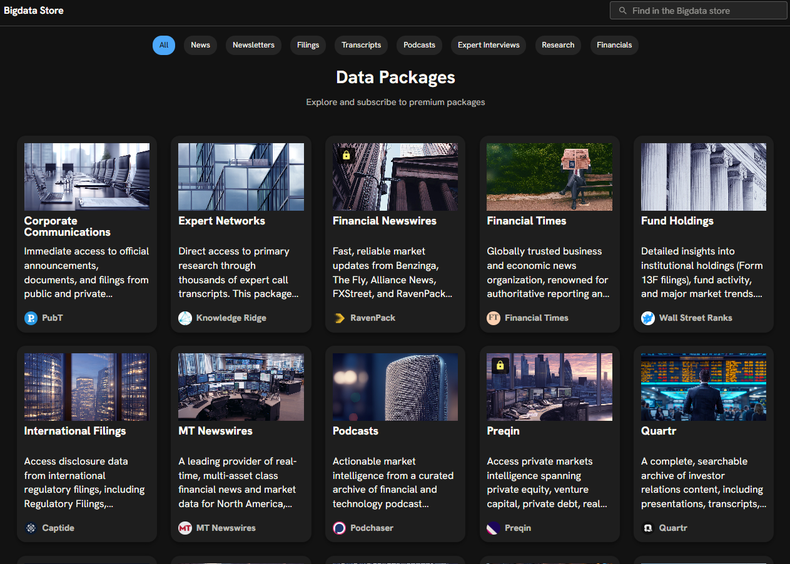

# Bigdata.com Plugins Marketplace

Official plugins created and maintained by [RavenPack](https://www.ravenpack.com/) for [Bigdata.com](https://bigdata.com/) — the no. 1 platform that powers AI agents for finance.

This repository serves as the registry for all official plugins available in the Bigdata.com marketplace.

## Available Plugins

| Plugin | Description | Documentation |
|--------|-------------|---------------|
| **bigdata-com** | MCP tools to retrieve structured and unstructured financial data from Bigdata.com services. Includes the Bigdata MCP Connector and the Financial Research Analyst skill. | [View docs](https://docs.bigdata.com/mcp-reference/plugins/bigdata-com) |

## About Bigdata.com

Bigdata.com is the definitive data layer for AI in finance. It unifies the world's most valuable financial content — news, filings, transcripts, financials, press releases, expert calls, and more — making it ready for agentic workflows. Features include:

- **[Complete content ecosystem](https://platform.bigdata.com/store)**: Access premium sources spanning news, regulatory filings, earnings transcripts, and alternative data.

- **Search-first architecture**: Purpose-built retrieval for financial research across structured and unstructured datasets.
- **Grounded by design**: Full auditability with citations and source traceability.

## License

See [LICENSE](LICENSE) for details, or contact legal@ravenpack.com.
