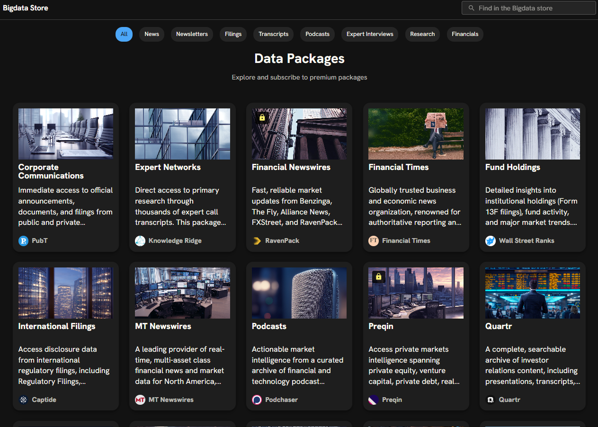

# Bigdata.com MCP server and plugins

[Bigdata.com](https://bigdata.com/) is the financial data layer for AI agents, built by [RavenPack](https://www.ravenpack.com/). Its remote MCP server gives any MCP client cited search over licensed news, regulatory filings, earnings call transcripts, broker research and private documents, plus company, country, market, ETF, sentiment and portfolio tearsheets, screens and an events calendar.

This repository is the public home of that server: the install guide for every host, the [official MCP Registry](https://registry.modelcontextprotocol.io/v0.1/servers/com.bigdata%2Fbigdata-mcp/versions/latest) entry (`server.json`), and the official **bigdata-com** plugin with 27 financial research skills for Claude, VS Code, Copilot CLI and Cursor team marketplaces.

The server itself is a hosted service at `https://mcp.bigdata.com/`. There is nothing to run locally.

| | |
|---|---|
| Endpoint | `https://mcp.bigdata.com/` (Streamable HTTP) |
| Authentication | OAuth (authorization code with PKCE) on hosts with an official Bigdata.com connector, app or tool, or an API key in the `x-api-key` header |
| API keys | [platform.bigdata.com/api-keys](https://platform.bigdata.com/api-keys) |
| Registry name | `com.bigdata/bigdata-mcp` |
| Documentation | [MCP reference](https://docs.bigdata.com/mcp-reference/introduction), [tools](https://docs.bigdata.com/mcp-reference/introduction#tools), [skills](https://docs.bigdata.com/skills-reference/introduction) |
| Support | [support@bigdata.com](mailto:support@bigdata.com) |

## Quick start for any MCP client

Create an API key at [platform.bigdata.com/api-keys](https://platform.bigdata.com/api-keys), then add the server to any client that takes an `mcpServers` map:

```json
{
  "mcpServers": {
    "bigdata.com": {
      "url": "https://mcp.bigdata.com/",
      "headers": {
        "x-api-key": "YOUR_API_KEY"
      }
    }
  }
}
```

Then ask your assistant something like:

```
Prepare an earnings preview for Broadcom with inline citations.
```

## Authentication

| Host | Method | Notes |
|---|---|---|
| Claude.ai, Claude Desktop | OAuth | Official connector in the Claude directory. Sign in with your Bigdata.com account. |
| ChatGPT | OAuth | Official app in the ChatGPT directory. Sign in with your Bigdata.com account. |
| Microsoft Copilot Studio | OAuth | Listed in the Copilot Studio tool catalog as Bigdata.com MCP. |
| Cursor, VS Code, Copilot CLI, Claude Code, Codex, Snowflake Cortex Code, Qwen Code, Grok, Cline and any other MCP client | API key | Send the key as the `x-api-key` header. |

GitHub Docs state that Copilot cloud agent and Copilot code review "do not currently support remote MCP servers that leverage OAuth", so use the API key there.

## Install

### VS Code and GitHub Copilot

One click: [Install in VS Code](https://insiders.vscode.dev/redirect?url=vscode%3Amcp%2Finstall%3F%257B%2522name%2522%253A%2522bigdata.com%2522%252C%2522type%2522%253A%2522http%2522%252C%2522url%2522%253A%2522https%253A%252F%252Fmcp.bigdata.com%252F%2522%252C%2522headers%2522%253A%257B%2522x-api-key%2522%253A%2522%2524%257Binput%253Abigdata-api-key%257D%2522%257D%252C%2522inputs%2522%253A%255B%257B%2522type%2522%253A%2522promptString%2522%252C%2522id%2522%253A%2522bigdata-api-key%2522%252C%2522description%2522%253A%2522Bigdata.com%2520API%2520key%2520%2528platform.bigdata.com%252Fapi-keys%2529%2522%252C%2522password%2522%253Atrue%257D%255D%257D) or [Install in VS Code Insiders](https://insiders.vscode.dev/redirect?url=vscode-insiders%3Amcp%2Finstall%3F%257B%2522name%2522%253A%2522bigdata.com%2522%252C%2522type%2522%253A%2522http%2522%252C%2522url%2522%253A%2522https%253A%252F%252Fmcp.bigdata.com%252F%2522%252C%2522headers%2522%253A%257B%2522x-api-key%2522%253A%2522%2524%257Binput%253Abigdata-api-key%257D%2522%257D%252C%2522inputs%2522%253A%255B%257B%2522type%2522%253A%2522promptString%2522%252C%2522id%2522%253A%2522bigdata-api-key%2522%252C%2522description%2522%253A%2522Bigdata.com%2520API%2520key%2520%2528platform.bigdata.com%252Fapi-keys%2529%2522%252C%2522password%2522%253Atrue%257D%255D%257D). VS Code prompts for the API key once and stores it.

Or add this to `.vscode/mcp.json` in a workspace, or to your user `mcp.json` via **MCP: Add Server**:

```json
{
  "inputs": [
    {
      "type": "promptString",
      "id": "bigdata-api-key",
      "description": "Bigdata.com API key (platform.bigdata.com/api-keys)",
      "password": true
    }
  ],
  "servers": {
    "bigdata.com": {
      "type": "http",
      "url": "https://mcp.bigdata.com/",
      "headers": {
        "x-api-key": "${input:bigdata-api-key}"
      }
    }
  }
}
```

To add the research skills as well, open the Command Palette, run **Chat: Install Plugin From Source**, paste `https://github.com/Bigdata-com/bigdata-plugins-marketplace`, then search `@agentPlugins bigdata` in the Extensions view. Full guide: [Install Bigdata plugin](https://docs.bigdata.com/skills-reference/install-bigdata-plugin).

### GitHub Copilot CLI

```bash
copilot mcp add --transport http --header "x-api-key: YOUR_API_KEY" bigdata-com https://mcp.bigdata.com/
```

For the skills, register this repository as a plugin marketplace and install the plugin:

```bash
copilot plugin marketplace add Bigdata-com/bigdata-plugins-marketplace
copilot plugin install bigdata-com@bigdata-plugins-marketplace
```

### Claude.ai and Claude Desktop

Bigdata.com is an official connector. Team and Enterprise admins add it under **Organization settings, Connectors, Browse Connectors**; each user then clicks **Connect** and signs in to Bigdata.com. Guide: [Claude MCP Integration](https://docs.bigdata.com/mcp-reference/oauth-integrations/claude-mcp-integration).

The plugin with the research skills is in the [Claude plugin directory](https://claude.com/plugins/bigdata-com).

### Claude Code

```bash
claude mcp add --transport http bigdata_com https://mcp.bigdata.com/ --header "x-api-key: YOUR_API_KEY"
```

Then run `/plugins` inside Claude Code and install the Bigdata plugin from the official marketplace. Guide: [Claude Code MCP Integration](https://docs.bigdata.com/mcp-reference/api-integrations/claude-code-mcp-integration).

### ChatGPT

Bigdata.com is an official app. Workspace admins enable it under **Workspace settings, Apps**; users add it from **Settings, Apps, Add more**. Guide: [ChatGPT MCP Integration](https://docs.bigdata.com/mcp-reference/oauth-integrations/chatgpt-mcp-integration). The research skills ship as a [ChatGPT plugin](https://chatgpt.com/plugins/plugin_asdk_app_69491eceef3c8191beb70788b7840429).

### Codex CLI and ChatGPT desktop

Codex, the Codex IDE extension and the ChatGPT desktop app share `~/.codex/config.toml`:

```toml
[mcp_servers.bigdata_com]
url = "https://mcp.bigdata.com/"
env_http_headers = { "x-api-key" = "BIGDATA_API_KEY" }
```

Export `BIGDATA_API_KEY` in your shell, or replace `env_http_headers` with `http_headers = { "x-api-key" = "YOUR_API_KEY" }`.

### Cursor

[](cursor://anysphere.cursor-deeplink/mcp/install?name=bigdata.com&config=eyJ1cmwiOiJodHRwczovL21jcC5iaWdkYXRhLmNvbS8iLCJoZWFkZXJzIjp7IngtYXBpLWtleSI6ImJkX3YxX1hYWFhYWFhYWFhYWFhYWFhYWFhYWFhYWFhYWFhYWFhYWFhYIn19)

Replace the placeholder in the `x-api-key` field with your key and click **Install**. Guide: [MCP Integration with API Key](https://docs.bigdata.com/mcp-reference/api-integrations/mcp-api-integration). Cursor Teams and Enterprise admins can import this repository as a team marketplace (Dashboard, Plugins & MCPs, Add Marketplace, Import from Repo); the Cursor manifests are in `.cursor-plugin/`.

### Microsoft Copilot Studio

Bigdata.com is an official tool in Copilot Studio. Open your agent, go to **Tools, Add tool**, search **Bigdata.com**, select **Bigdata.com MCP** and click **Add and configure**. The agent can then be shared in Teams and Microsoft 365 Copilot. Guide: [Microsoft Copilot MCP Integration](https://docs.bigdata.com/mcp-reference/oauth-integrations/microsoft-copilot-mcp-integration).

### Snowflake Cortex Code

Add to `~/.snowflake/cortex/mcp.json`:

```json
{
  "mcpServers": {
    "mcp.bigdata.com": {
      "type": "http",
      "url": "https://mcp.bigdata.com/",
      "headers": {
        "x-api-key": "${YOUR_API_KEY}"
      }
    }
  }
}
```

### Qwen Code

```bash
qwen mcp add --scope user --transport http bigdata-com https://mcp.bigdata.com/ --header "x-api-key: YOUR_API_KEY"
```

Guide: [Qwen Code MCP Integration](https://docs.bigdata.com/mcp-reference/api-integrations/qwen-mcp-integration).

### Grok (xAI SDK)

Pass the server as a remote MCP tool in the API call, with the key in the request headers. Guide: [Grok MCP Integration](https://docs.bigdata.com/mcp-reference/api-integrations/grok-mcp-integration).

### Cline and clients that only speak stdio

Cline installs from this README; [`llms-install.md`](llms-install.md) holds the same steps in the shortest form for agents. Clients without Streamable HTTP support can bridge through [`mcp-remote`](https://www.npmjs.com/package/mcp-remote):

```json
{
  "mcpServers": {
    "bigdata.com": {
      "command": "npx",
      "args": ["-y", "mcp-remote", "https://mcp.bigdata.com/", "--header", "x-api-key:${BIGDATA_API_KEY}"],
      "env": { "BIGDATA_API_KEY": "YOUR_API_KEY" }
    }
  }
}
```

## Tools

Grouped by job. The authoritative list, with parameters and examples, is the [MCP reference](https://docs.bigdata.com/mcp-reference/introduction#tools); clients also get it from the server's `tools/list`. Search results and sentiment narratives carry source citations.

- **Search and lookup**: cited similarity search across news, regulatory filings, earnings call transcripts, podcasts, expert interviews, broker research and uploaded documents; resolution of companies, securities (name, ticker, ISIN, CUSIP, SEDOL) and other entities.
- **Tearsheets**: company, country, market, ETF, sentiment and portfolio.
- **Screens and calendars**: company screening by market cap, price, sector, industry, country and exchange; corporate event and macroeconomic release calendars.
- **Private content**: connectors, tags, document listing, fetch and upload for your own corpus.

## Plugins

| Plugin | Description | Documentation |
|--------|-------------|---------------|
| **bigdata-com** | 27 financial research skills on top of the MCP tools: company briefs, earnings previews, digests and reactions, valuation snapshots, peer comparables, investment memos, risk assessments, catalyst monitors, moat and governance reviews, sector, thematic, country and regional analysis, scenario analysis and post-IPO reviews. Includes the MCP connector configuration. | [View docs](https://docs.bigdata.com/mcp-reference/plugins/bigdata-com) |

Manifests: `.claude-plugin/marketplace.json` (Claude Code and Copilot CLI), `.cursor-plugin/marketplace.json` (Cursor), `plugins/bigdata-com/.mcp.json` (the connector).

## Registry entry

`server.json` at the root is the record published to the official MCP Registry under `com.bigdata/bigdata-mcp`. The GitHub MCP Registry lists servers from that registry once GitHub has onboarded them.

## About Bigdata.com

Bigdata.com is the definitive data layer for AI in finance. It unifies the world's most valuable financial content, news, filings, transcripts, financials, press releases, expert calls and more, making it ready for agentic workflows.

- **[Complete content ecosystem](https://platform.bigdata.com/store)**: premium sources spanning news, regulatory filings, earnings transcripts and alternative data.
- **Search-first architecture**: purpose-built retrieval for financial research across structured and unstructured datasets.
- **Grounded by design**: full auditability with citations and source traceability.



## License

See [LICENSE](LICENSE) for details, or contact legal@ravenpack.com.
